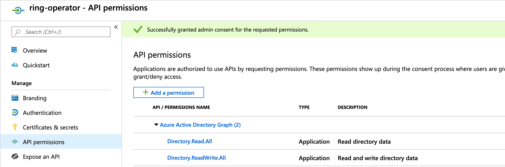

# Ring Operator

## Overview

The Ring Operator is an implementation of branch-based development and deployment for Kubernetes. Rings are routing rules which map user groups to revisions of code. This project allows Rings to run on Kubernetes.

Traefik is used as the underlying router to implement header-based routing. When a request is received for a certain ring, Traefik will provide the routing to the appropriate backend service. The ring operator ensures that these rules are correctly installed. Requests typically belong to an instance of a user or "calling" actor. AAD Groups are used for membership and providing a glue to keep services within rings. Traefik will default to the production (master) ring if a caller tries to call a service's ring which does not exist.

## Prerequisites

- [go version v1.12+](https://golang.org/dl/)
- docker version 17.03+
- [operator-sdk](https://github.com/operator-framework/operator-sdk/blob/master/doc/user/install-operator-sdk.md)
- Access to a kubernetes v1.9.0+ cluster


## Operation

### Installation

The Ring Operator takes a strong dependency on Traefik. The following commands install Traefik and the Custom Resource Definition for Rings and the Ring Operator. The Ring CRD informs Kubernetes that it will receive specifications with the fields and types in the CRD specification. The Ring Operator will become the leader for the reconciliation once the Ring specifications are received.

```bash
# Install Traefik
kubectl apply -f deploy/traefik

# Install Ring CRD
kubectl apply -f deploy/crds/rings_v1alpha1_ring_crd.yaml

# Install Ring Operator
kubectl apply -f deploy/operator.yaml
```

### Service Principal Permissions

The operator uses service principals or managed identities to authenticate with the Microsoft Graph. They will need authorization for `graph.windows.net` which requires access to the `Azure Active Directory Graph` API and the following permissions to create AD groups:
- Directory.Read.All
- Directory.ReadWrite.All



### Building the Operator

#### Install Dependencies

```bash
GO111MODULE=on go build
```

#### Run Locally

The simplest way to run the operator without publishing will be using the command `operator-sdk up local`. Alternatively, running `go run ./cmd/main.go` will work as long as the environment variables below are present. 

For the operator to start correctly you will need your Kubernetes cluster config set up. The default config lives at ~/.kube/config. If you don't have this set up yet then you can run `az aks get-credentials -n $NAME -g $RESOURCE_GROUP` to connect to an existing AKS cluster.

The operator expects the following environment variables to exist with some sample values:

| Name                | Sample Value                         |
|---------------------|--------------------------------------|
| KUBERNETES_CONFIG   | ~/.kube/config                       |
| WATCH_NAMESPACE     | default                              |
| AZURE_TENANT_ID     | 6267e414-72fe-48c9-88af-fff9d7f733e4 |
| AZURE_CLIENT_ID     | 5cd96c99-2cfc-4325-b501-ad0c08a7f13e |
| AZURE_CLIENT_SECRET | 6=v*7i-g*LBDQKXEsKRT21L5u.UDS?qw     |

#### Debug Locally

The operator can be debugged using a golang debugger and running using the standard go toolchain with the environment variables above present.

#### Publish Docker Image

Use the following commands to build the operator image and publish it to a docker repository.

```bash
# Sample Image repo and tag
#IMAGE=rings.azurecr.io/ring-operator:v0.0.1-alpha1
operator-sdk build $IMAGE
docker push $IMAGE
```


## Request Workflow

1. Receives a new reconciliation request
2. Check that a specificiation exists for the Ring request
3. Ensure
    - An AAD Group exists
    - A StripPrefix Middleware exists for stripping path prefixes
    - A Service exists
    - An IngressRoute exists

## Additional Resources
- [Operator User Guide](https://github.com/operator-framework/operator-sdk/blob/master/doc/user-guide.md)

# Contributing

This project welcomes contributions and suggestions.  Most contributions require you to agree to a
Contributor License Agreement (CLA) declaring that you have the right to, and actually do, grant us
the rights to use your contribution. For details, visit https://cla.opensource.microsoft.com.

When you submit a pull request, a CLA bot will automatically determine whether you need to provide
a CLA and decorate the PR appropriately (e.g., status check, comment). Simply follow the instructions
provided by the bot. You will only need to do this once across all repos using our CLA.

This project has adopted the [Microsoft Open Source Code of Conduct](https://opensource.microsoft.com/codeofconduct/).
For more information see the [Code of Conduct FAQ](https://opensource.microsoft.com/codeofconduct/faq/) or
contact [opencode@microsoft.com](mailto:opencode@microsoft.com) with any additional questions or comments.

**Notes:

Profile store must assign a header for a group and that will be a unique match for rules on traffic flowing through Traefik.